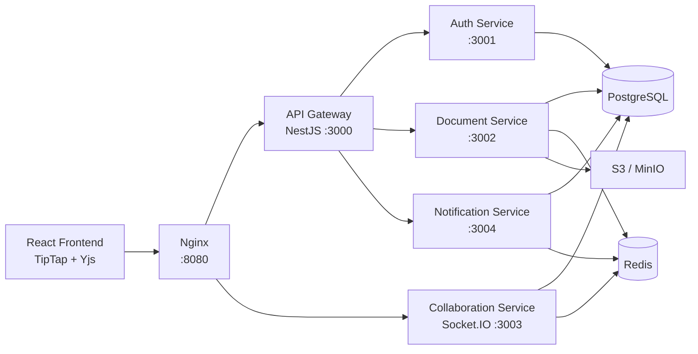

# CRDTDocs

> A production-oriented, Google Docs-like collaborative SaaS built with React, NestJS, PostgreSQL, Redis, Socket.IO, and Yjs.

<p align="center">
  
  
  
  
  
  
</p>

<p align="center">
  <b>Rich text editing</b> • <b>CRDT collaboration</b> • <b>Live presence</b> • <b>Document sharing</b> • <b>Comments</b> • <b>File uploads</b>
</p>

---

## ✨ Product Preview


---

## 🚀 What This App Does

CRDTDocs is a collaborative document platform that feels like a small SaaS product rather than a throwaway demo. Users can create workspaces, write rich text documents, share them with role-based permissions, collaborate live, comment on selected text, receive notifications, and attach files through S3-compatible storage.

### Core Capabilities

- 🔐 JWT authentication with bcrypt password hashing
- 🏢 Workspace creation, invite codes, and membership roles
- 📄 Rich text documents using TipTap and structured JSON content
- ⚡ Real-time multi-user editing with Yjs CRDT updates
- 👥 Live collaborators and presence tracking
- 🔑 Owner, editor, and viewer permissions enforced on the backend
- 💬 Threaded comments with real-time resolution updates
- 🔔 In-app notifications for shares and comments
- 📎 File upload flow using S3-compatible presigned URLs
- 🐳 One-command local development with Docker Compose
- 🌐 Nginx reverse proxy with AWS EC2 deployment notes

---

## 🧱 Tech Stack

| Layer | Technology |
| --- | --- |
| Frontend | React, TypeScript, Vite, TipTap |
| Collaboration | Yjs, y-protocols awareness, Socket.IO |
| Backend | Node.js, NestJS, modular services |
| API Gateway | NestJS reverse proxy service |
| Database | PostgreSQL |
| Cache / PubSub | Redis |
| Object Storage | AWS S3, MinIO locally |
| Auth | JWT fallback auth, bcrypt |
| Infra | Docker, Docker Compose, Nginx |
| Cloud Target | AWS EC2 free-tier friendly, optional RDS/S3/Cognito |

---

## 🗺️ Architecture



### Request Flow

1. The frontend calls REST endpoints through `/api`.
2. Nginx forwards `/api/*` to the API Gateway.
3. The gateway proxies requests to auth, document, and notification services.
4. The editor connects to `/collaboration` over Socket.IO.
5. Yjs CRDT updates are synced through the collaboration service.
6. Redis powers Socket.IO scale-out, presence state, and comment event fan-out.
7. PostgreSQL stores users, workspaces, permissions, documents, comments, notifications, and file metadata.

---

## 📁 Monorepo Structure

```text
collab-system/
  apps/
    frontend/                 React + TypeScript + TipTap app
    api-gateway/              NestJS API gateway
  services/
    auth-service/             Registration, login, JWT, user profile
    document-service/         Workspaces, documents, sharing, comments, files
    collaboration-service/    Socket.IO + Yjs sync + presence
    notification-service/     In-app notification APIs
  packages/
    common/                   Shared auth, DB, Redis, guards, middleware
    types/                    Shared TypeScript contracts
  infra/
    docker/postgres/          Schema and seed SQL
    nginx/                    Local and production Nginx configs
    aws/                      EC2 deployment notes and env example
  docker-compose.yml
  README.md
```

---

## ⚡ Quick Start

### Prerequisites

- Docker Desktop running with the Linux engine
- Ports available: `8080`, `3000-3004`, `5432`, `6379`, `9000`, `9001`

### Run Everything

```bash
docker compose up --build
```

Open the app:

```text
http://localhost:8080
```

Useful local URLs:

| Service | URL |
| --- | --- |
| App | `http://localhost:8080` |
| API Gateway Health | `http://localhost:8080/api/health` |
| API Gateway Direct | `http://localhost:3000/health` |
| MinIO Console | `http://localhost:9001` |

### Seeded Users

| Role | Email | Password |
| --- | --- | --- |
| Owner | `owner@example.com` | `password123` |
| Editor | `editor@example.com` | `password123` |
| Viewer | `viewer@example.com` | `password123` |

---

## 🔧 Environment

Copy the example file if you want local overrides:

```bash
cp .env.example .env
```

The Docker setup works with defaults:

```text
POSTGRES_DB=collab
POSTGRES_USER=collab
POSTGRES_PASSWORD=collab_password
REDIS_URL=redis://redis:6379
AWS_S3_BUCKET=collab-uploads
AWS_S3_ENDPOINT=http://minio:9000
JWT_SECRET=local-development-secret-change-me
```

For real AWS S3, set `AWS_REGION`, `AWS_S3_BUCKET`, `AWS_ACCESS_KEY_ID`, and `AWS_SECRET_ACCESS_KEY`, then leave `AWS_S3_ENDPOINT` empty.

---

## 🧪 Local Development Without Docker

Use Docker for PostgreSQL and Redis, or provide equivalent local services. Then install and build:

```bash
npm install
npm run build
```

Run services separately:

```bash
npm run start:dev -w @collab/auth-service
npm run start:dev -w @collab/document-service
npm run start:dev -w @collab/collaboration-service
npm run start:dev -w @collab/notification-service
npm run start:dev -w @collab/api-gateway
npm run dev -w @collab/frontend
```

---

## 🔌 API Overview

All routes are available behind Nginx as `/api/*`.

### Auth & Users

| Method | Route | Description |
| --- | --- | --- |
| `POST` | `/auth/register` | Create account |
| `POST` | `/auth/login` | Login and receive JWT |
| `GET` | `/users/me` | Current user profile |
| `PATCH` | `/users/me` | Update profile |

### Workspaces

| Method | Route | Description |
| --- | --- | --- |
| `GET` | `/workspaces` | List joined and shared workspaces |
| `POST` | `/workspaces` | Create workspace |
| `GET` | `/workspaces/:workspaceId` | Workspace detail |
| `POST` | `/workspaces/join` | Join by invite code |
| `POST` | `/workspaces/:workspaceId/invites` | Rotate invite code |

### Documents

| Method | Route | Description |
| --- | --- | --- |
| `GET` | `/workspaces/:workspaceId/documents` | List accessible documents |
| `POST` | `/workspaces/:workspaceId/documents` | Create document |
| `GET` | `/documents/:documentId` | Document detail |
| `PATCH` | `/documents/:documentId` | Update title/content |
| `DELETE` | `/documents/:documentId` | Soft delete |
| `POST` | `/documents/:documentId/share` | Share by email or user ID |
| `GET` | `/documents/:documentId/permissions` | List document permissions |

### Comments, Notifications, Files

| Area | Routes |
| --- | --- |
| Comments | `GET/POST /documents/:documentId/comments`, `POST /comments/:commentId/replies`, `PATCH /comments/:commentId/resolve` |
| Notifications | `GET /notifications`, `PATCH /notifications/:notificationId/read`, `PATCH /notifications/read-all` |
| Files | `GET /documents/:documentId/files`, `POST /documents/:documentId/files/presign`, `POST /documents/:documentId/files/complete` |

---

## 🔁 WebSocket Contract

Socket.IO namespace:

```text
/collaboration
```

Client connection:

```ts
io('/collaboration', {
  auth: { token: jwt },
  transports: ['websocket', 'polling'],
});
```

| Event | Direction | Payload |
| --- | --- | --- |
| `document:join` | Client → Server | `{ documentId }` |
| `document:sync` | Server → Client | `{ documentId, update, role }` |
| `document:update` | Both | `{ documentId, update }` |
| `presence:update` | Both | `{ documentId, update }` |
| `presence:users` | Server → Client | `CollaboratorPresence[]` |
| `comment:upsert` | Server → Client | `{ type, documentId, comment }` |
| `collaboration:error` | Server → Client | `{ message }` |

The collaboration service verifies JWTs and document permissions before joining rooms or accepting edits.

---

## 🔐 Permission Model

Document roles:

| Role | Capabilities |
| --- | --- |
| Owner | Read, edit, share, delete, comment, upload |
| Editor | Read, edit, comment, upload |
| Viewer | Read-only |

Workspace roles map to default document access:

| Workspace Role | Effective Document Access |
| --- | --- |
| Owner | Owner |
| Admin | Editor |
| Member | Viewer |

Direct `document_permissions` can grant access to users who are not workspace members. In that case, the workspace appears as `shared with me`, but only the directly shared documents are listed.

---

## 🗄️ Database

The canonical schema lives at:

```text
infra/docker/postgres/01-init.sql
```

Core tables:

- `users`
- `workspaces`
- `workspace_members`
- `documents`
- `document_permissions`
- `comments`
- `notifications`
- `files`

Indexes cover login lookup, workspace membership, document listing, direct permissions, comments, unread notifications, and file metadata.

---

## 🐳 Docker Services

| Service | Port | Purpose |
| --- | --- | --- |
| `nginx` | `8080` | Reverse proxy for frontend, REST, and Socket.IO |
| `frontend` | internal `80` | React production build |
| `api-gateway` | `3000` | REST gateway |
| `auth-service` | `3001` | Authentication and users |
| `document-service` | `3002` | Workspaces, docs, sharing, comments, files |
| `collaboration-service` | `3003` | Realtime Yjs and presence |
| `notification-service` | `3004` | In-app notifications |
| `postgres` | `5432` | Database |
| `redis` | `6379` | Cache, pub/sub, presence |
| `minio` | `9000`, `9001` | Local S3-compatible storage |

---

## ☁️ Deployment Notes

The app is designed to run on an AWS EC2 free-tier style host using Docker Compose and Nginx.

Recommended production path:

1. Provision EC2 Ubuntu instance.
2. Install Docker and Docker Compose plugin.
3. Point DNS to the EC2 public IP.
4. Configure production `.env`.
5. Use Nginx as reverse proxy.
6. Enable HTTPS with Let's Encrypt.
7. Use AWS S3 for file storage.
8. Optionally move PostgreSQL to RDS and auth to Cognito.

Full guide:

```text
infra/aws/ec2-deploy.md
```

---

## 🧠 Engineering Highlights

- CRDT-based editing avoids last-write-wins document conflicts.
- REST permissions and WebSocket permissions are both enforced server-side.
- Redis is used for WebSocket scale-out, presence, and cross-service comment events.
- Shared documents are visible to non-workspace members without exposing unrelated workspace documents.
- Unauthorized direct document URLs show a clear access message instead of an infinite loading state.
- Comment resolution is real-time and shows the user who resolved the thread.
- File uploads use presigned URLs so large binary traffic does not pass through the API service.

---

## 🛣️ Roadmap Ideas

- Add automated test suite with API integration tests and frontend component tests.
- Add document version history and restore points.
- Add mentions and email notifications.
- Add organization-level billing and workspace settings.
- Add richer editor extensions such as tables, images, slash commands, and markdown shortcuts.
- Add OpenTelemetry tracing across services.
